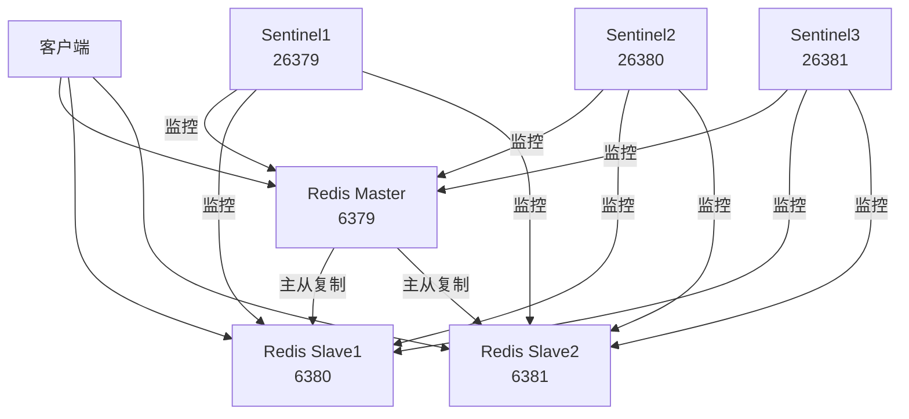

# Redis 主从复制与哨兵模式部署

本项目使用 Docker Compose 部署 Redis 主从复制（Master-Slave）架构，并配置哨兵（Sentinel）模式实现高可用。

## 架构说明



## 端口说明

- Redis Master: 6379
- Redis Slave1: 6380
- Redis Slave2: 6381
- Sentinel1: 26379
- Sentinel2: 26380
- Sentinel3: 26381

## 快速开始

### 1. 环境要求

- Docker
- Docker Compose

### 2. 启动服务

```bash
# 构建并启动所有服务
docker compose up -d

# 查看服务状态
docker compose ps

# 查看服务日志
docker compose logs
```

### 3. 验证部署

```bash
# 连接到主节点
docker exec -it redis-master redis-cli

# 连接到从节点
docker exec -it redis-slave1 redis-cli -p 6380
docker exec -it redis-slave2 redis-cli -p 6381

# 连接到哨兵节点
docker exec -it redis-sentinel1 redis-cli -p 26379
```

### 4. 常用命令

```bash
# 查看主从复制状态
redis-cli info replication

# 查看哨兵状态
redis-cli -p 26379 sentinel masters
redis-cli -p 26379 sentinel slaves mymaster

# 停止服务
docker compose down

# 停止服务并删除数据卷
docker compose down -v
```

## 配置说明

### Redis 主从配置

- 主节点：默认端口 6379
- 从节点1：端口 6380
- 从节点2：端口 6381
- 密码：bjtest123

### 哨兵配置

- 哨兵1：端口 26379
- 哨兵2：端口 26380
- 哨兵3：端口 26381
- 监控主节点：redis-master:6379
- 故障转移阈值：2
- 故障转移超时：10000ms

## 数据持久化

所有 Redis 节点的数据都通过 Docker 数据卷持久化：

- redis-master-data
- redis-slave1-data
- redis-slave2-data

## 网络配置

所有服务都在 `redis-net` 网络中，使用 bridge 驱动。

## 故障转移测试

1. 停止主节点：
```bash
docker compose stop redis-master
```

2. 观察哨兵日志：
```bash
docker compose logs -f sentinel1
```

3. 验证新的主节点：
```bash
redis-cli -p 26379 sentinel masters
```

## 注意事项

1. 确保所有端口未被占用
2. 生产环境建议修改默认密码
3. 建议配置适当的资源限制
4. 定期备份数据卷

## 维护命令

```bash
# 停止集群
docker-compose down

# 查看日志
docker-compose logs

# 重启特定服务
docker-compose restart redis-master

# 查看容器状态
docker-compose ps
```

## 故障排查

1. 检查容器状态：
```bash
docker-compose ps
```

2. 查看容器日志：
```bash
docker-compose logs redis-master
docker-compose logs redis-slave1
docker-compose logs sentinel1
```

3. 进入容器：
```bash
docker exec -it redis-master bash
```

## 许可证

MIT 